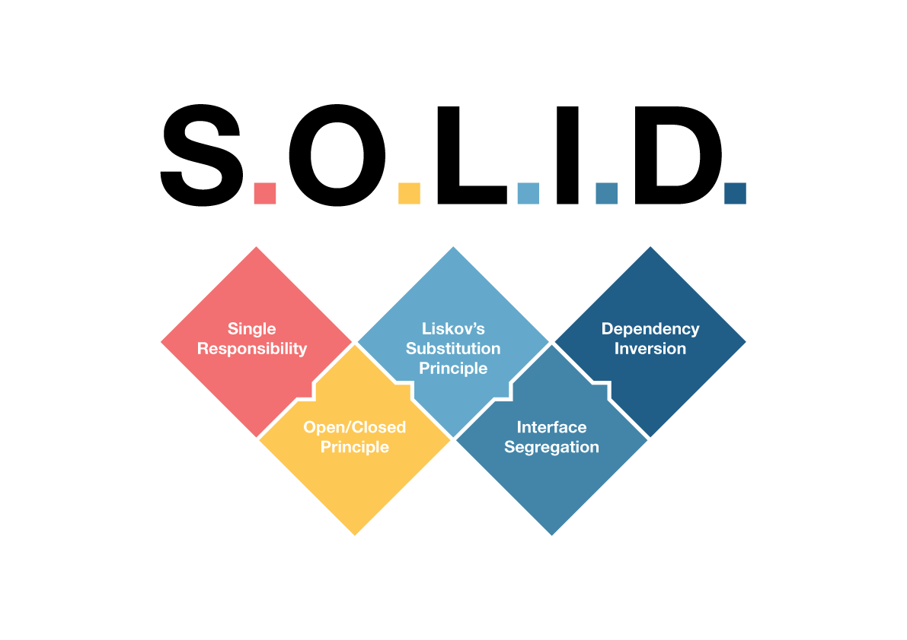

# SOLID-Principles-in-Swift

- Single Responsibility Principle (SRP): Keep your Swift classes focused on a single task or functionality. Just like a tool in a toolbox is designed for one job, each class should have only one reason to be updated or changed.
- Open/Closed Principle (OCP): Your Swift classes should be like building blocks. You can add more blocks to create new structures (extensions) without needing to change the original blocks (modification). This encourages building upon existing code without altering it.
- Liskov Substitution Principle (LSP): Imagine you have a universal remote control designed to work with any TV. The basic expectation from any TV, in this case, is that it can turn on and off, change channels, and adjust volume.
Now, let's say you have a specific type of TV, an "EcoTV," which is designed to save energy. However, this EcoTV has a peculiar behavior: when you try to change the channel, it turns off to save power. This is unusual behavior not expected from a standard TV.
In this scenario, the EcoTV violates the Liskov Substitution Principle. The universal remote (and by extension, you, the user) expects any TV it controls to maintain standard behaviors—like changing channels without turning off. The EcoTV, by changing this behavior, cannot be substituted seamlessly for a standard TV without altering the expected outcome of using the remote.
- Interface Segregation Principle (ISP): Just like choosing only the TV channels you like, in Swift, create specific protocols for specific needs. Don't force a class to conform to a protocol with methods it doesn't need.
- Dependency Inversion Principle (DIP): Continuing with the TV analogy, consider a SmartHome System designed to control various devices in your home, including TVs. The SmartHome System can turn TVs on or off, change channels, and adjust volumes through a standardized interface.
  Now, if the SmartHome System is designed to work only with a specific brand or model of TV, it's tightly coupled with that particular TV. This means if you decide to buy a new TV of a different brand or model, the SmartHome System might not work with it until it's specifically updated or adapted for the new TV.
  Dependency Inversion Principle suggests that the SmartHome System should not directly depend on specific TV models or brands. Instead, it should depend on an abstract TV interface that outlines the basic functionalities (on/off, change channel, volume control). Any TV model that wants to be compatible with the SmartHome System should implement this interface. This way, the SmartHome System can control any TV that conforms to the interface, making the system more flexible and adaptable to future changes or additions of new TV models
